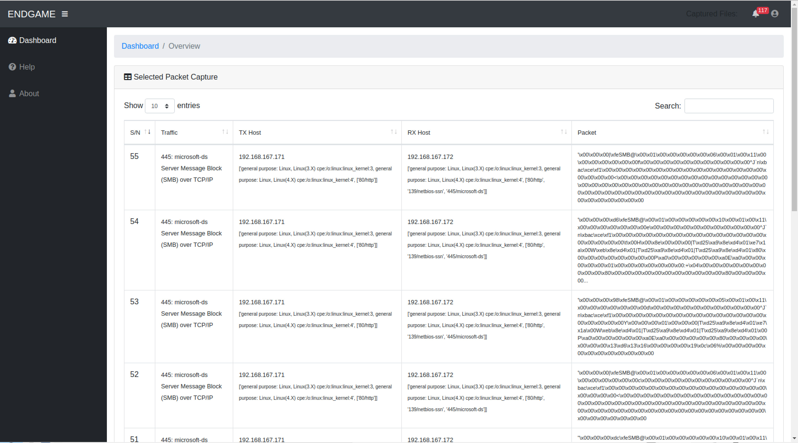
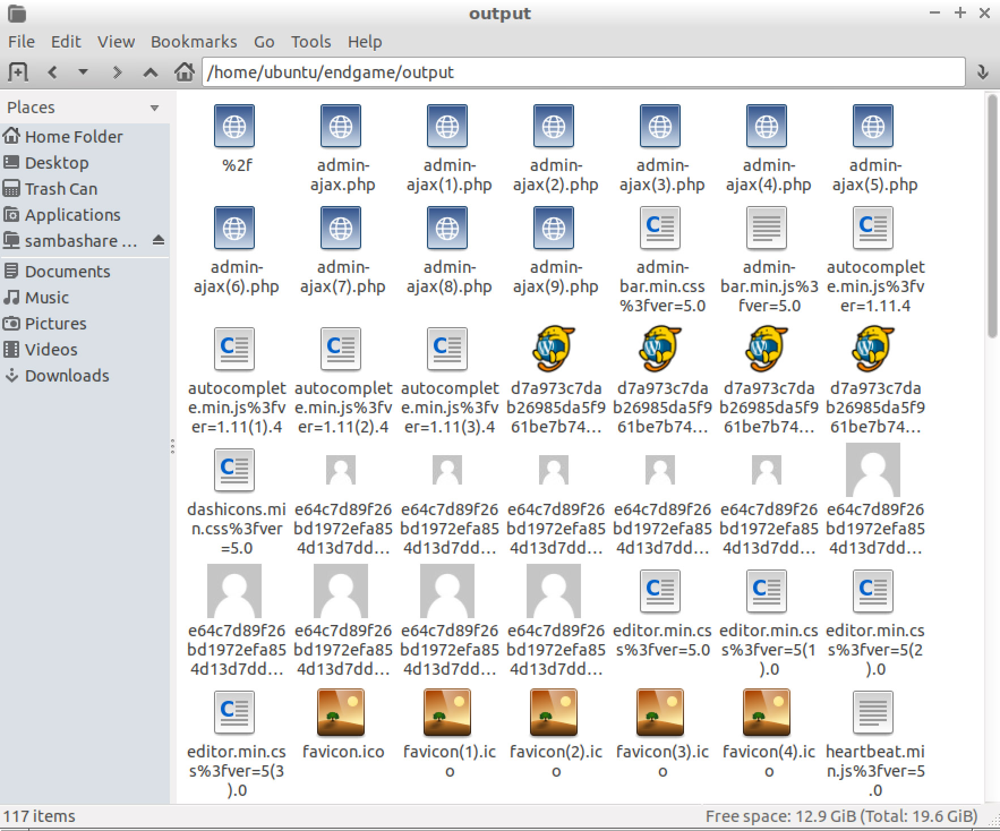

# endgame 

### Packet Capture + Interpretation

`endgame` is a Python application that captures packets into a `pcap` file and also interpretes the packets. Currently, `endgame` is able to

* Identify the type of packet (based on source/destination ports)
* Decode into plain test uncompressed unencrypted packet (e.g. HTML or JS files)
* Dump files that are transferred over unencrypted connections (e.g. HTTP, SMB or FTP)

### Motivation

Currently, Wireshark is most commonly used to capture packets and create pcap files. However the sheer amount of background knowledge makes it inaccessible as a teaching tool to learn network security principles.

We take our cybersecurity for granted until it is too late. All it takes is a single vulnerability.

The ability to monitor network traffic in its entirety and produce usable data LIVE will greatly lower the barrier to entry to defending your organisation from cyberattacks. One needs to identify the weakest links quickly as adversaries will definitely be seeking them out as easy targets to carry out malicious activity and wreak havoc within your organisation.
